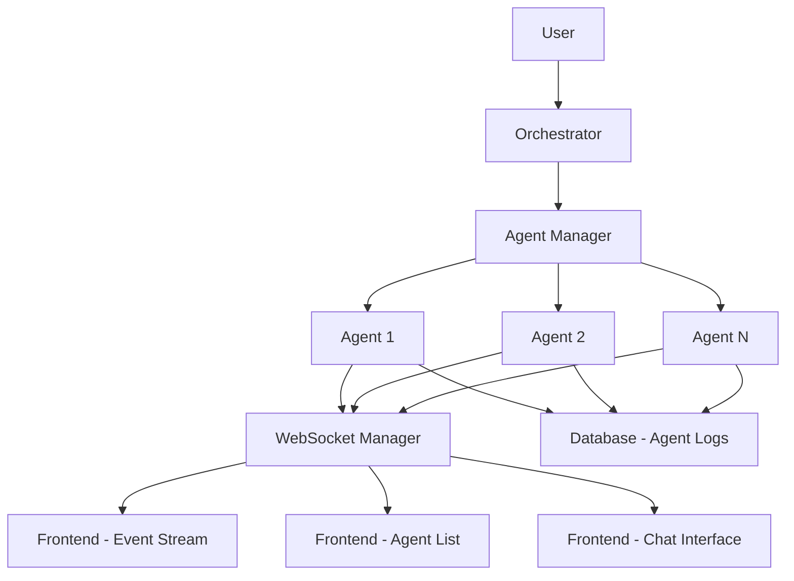

# Multi-Agent Orchestration System Documentation

## Overview

The Multi-Agent Orchestration System is a sophisticated framework that coordinates specialized AI agents to perform complex development tasks. It provides real-time monitoring, comprehensive logging, cost tracking, and seamless coordination through a centralized WebSocket-based communication system.

## Table of Contents

1. [Agent Delegation Architecture](#agent-delegation-architecture)
2. [Agent Templates and Specialization](#agent-templates-and-specialization)
3. [Coordination and Communication](#coordination-and-communication)
4. [Common Workflows and Best Practices](#common-workflows-and-best-practices)
5. [Development Guidelines](#development-guidelines)

---

## Agent Delegation Architecture

### Core Delegation System

The orchestrator delegates tasks through an intelligent agent management system that supports:
- **Template-based agent creation** with specialized capabilities
- **Real-time lifecycle management** through the AgentManager class
- **Session persistence** and context preservation
- **Comprehensive monitoring** and status tracking

### AgentManager Class

**File**: `apps/orchestrator_3_stream/backend/modules/agent_manager.py`

The AgentManager provides 8 core management tools:

```python
# Core delegation workflow
result = await self.create_agent(
    orchestrator_agent_id=self.orchestrator_agent_id,
    name=name,
    model=model or config.DEFAULT_AGENT_MODEL,
    system_prompt=system_prompt,
    working_dir=self.working_dir,
    metadata=metadata
)
```

#### Management Tools

1. **create_agent**: Creates new agents with template support
2. **list_agents**: Lists all active agents with status
3. **command_agent**: Sends commands to specific agents
4. **check_agent_status**: Monitors agent activity and health
5. **delete_agent**: Removes agents and cleans resources
6. **interrupt_agent**: Stops running agents gracefully
7. **read_system_logs**: Accesses comprehensive logs
8. **report_cost**: Tracks token usage and costs

### Agent Lifecycle and State Management

#### Agent States
- **IDLE**: Ready to accept commands
- **EXECUTING**: Processing a task
- **WAITING**: Awaiting input or resources
- **BLOCKED**: Waiting for external dependencies
- **COMPLETE**: Task finished successfully

#### Session Management
- **Token Tracking**: Real-time monitoring of input/output tokens
- **Cost Calculation**: Detailed cost breakdown per agent
- **File Tracking**: Individual FileTracker instances per agent
- **Context Preservation**: Session state across multiple commands

---

## Agent Templates and Specialization

### Template System Architecture

Templates are markdown files with YAML frontmatter stored in `.claude/agents/` directory:

```yaml
---
name: api-specialist
description: Specialist for API development, integration, and endpoint creation
tools: Read, Write, Edit, Glob, Grep, Bash, WebFetch, TodoWrite
model: sonnet
color: purple
---

# Detailed system prompt content...
```

### Available Specialized Agents

#### 1. build-agent
- **Purpose**: Single file implementation specialist
- **Tools**: Write, Read, Edit, Grep, Glob, Bash, TodoWrite
- **Model**: Sonnet
- **Use Case**: Perfect for implementing specific files according to detailed specifications
- **Color**: Blue

#### 2. api-specialist
- **Purpose**: API development, integration, and endpoint creation
- **Expertise**: FastAPI, NestJS, REST APIs, WebSocket streaming, API documentation
- **Tools**: Read, Write, Edit, Glob, Grep, Bash, WebFetch, TodoWrite
- **Model**: Sonnet
- **Color**: Purple

#### 3. database-architect
- **Purpose**: Database design and migration specialist
- **Expertise**: PostgreSQL, Prisma ORM, asyncpg, schema design
- **Tools**: Database-specific tools for schema management
- **Model**: Sonnet
- **Color**: Green

#### 4. security-auditor
- **Purpose**: Security review and vulnerability assessment
- **Expertise**: API security, authentication, data protection, compliance
- **Tools**: Security scanning and validation tools
- **Model**: Sonnet
- **Color**: Red

#### 5. mcp-server-developer
- **Purpose**: MCP server development specialist
- **Expertise**: Creating MCP servers, tool definitions, AI integrations
- **Tools**: MCP development and integration tools
- **Model**: Sonnet
- **Color**: Teal

#### 6. integration-specialist
- **Purpose**: System integration and connectivity
- **Expertise**: MCP servers, webhooks, API integration, external services
- **Tools**: Integration and connectivity tools
- **Model**: Sonnet
- **Color**: Orange

#### 7. ai-workflow-optimizer
- **Purpose**: AI workflow and automation specialist
- **Expertise**: Workflow analysis, automation, slash commands
- **Tools**: Workflow optimization tools
- **Model**: Sonnet
- **Color**: Cyan

#### 8. review-agent
- **Purpose**: Code review and validation specialist
- **Expertise**: Git diff analysis, risk assessment, validation
- **Tools**: Review and validation tools
- **Model**: Sonnet
- **Color**: Yellow

#### 9. meta-agent
- **Purpose**: Metacognitive and prompt engineering specialist
- **Expertise**: Agent configuration, prompt optimization
- **Tools**: Configuration and prompt engineering tools
- **Model**: Sonnet
- **Color**: Purple

#### 10. docs-scraper
- **Purpose**: Documentation extraction and processing
- **Expertise**: Fetching and saving documentation as markdown
- **Tools**: Web scraping and markdown processing tools
- **Model**: Sonnet
- **Color**: Blue

#### 11. playwright-validator
- **Purpose**: Frontend testing and validation
- **Expertise**: Browser automation, UI testing, web interactions
- **Tools**: Playwright testing and validation tools
- **Model**: Sonnet
- **Color**: Green

### Template Loading and Validation

**File**: `apps/orchestrator_3_stream/backend/modules/subagent_loader.py`

- **SubagentRegistry**: Discovers and caches templates
- **Pydantic Validation**: Ensures template integrity
- **Dynamic Tool Assignment**: Agents receive tools based on template specifications
- **Model Selection**: Supports different models for different use cases (Sonnet for quality, Haiku for speed)

---

## Coordination and Communication

### WebSocket-Based Real-Time Coordination

The system uses a sophisticated WebSocket infrastructure for real-time agent communication:

#### WebSocket Manager
**File**: `apps/orchestrator_3_stream/backend/modules/websocket_manager.py`

```python
# Real-time event broadcasting
await ws_manager.broadcast_agent_created(agent_data)
await ws_manager.broadcast_agent_status_change(agent_id, old_status, new_status)
await ws_manager.broadcast_agent_log(log_data)
await ws_manager.broadcast_agent_summary_update(agent_id, summary)
```

#### Event Broadcasting System

1. **Agent Events**: Creation, status changes, completions
2. **Log Events**: All agent activities with categorized logs
3. **Tool Events**: Pre and post tool use hooks
4. **System Events**: Orchestrator-level notifications

### Hook-Based Event Tracking

#### 6 Hook Types
- **PreToolUse**: Before tool execution
- **PostToolUse**: After tool completion
- **UserPromptSubmit**: When user submits prompts
- **Stop**: Agent termination
- **SubagentStop**: Subagent termination
- **PreCompact**: Before context compaction

#### Database Persistence
All events are logged to the `agent_logs` table with:
- Event categories (tool, hook, response, etc.)
- Timestamps and agent associations
- Complete event data for analysis
- AI-generated summaries for context

### Communication Flow Architecture



### File Coordination System

- **FileTracker Integration**: Each agent monitors file operations
- **File Operation Hooks**: Automatic tracking of Write, Edit, Read operations
- **Context Preservation**: File changes attached to responses as metadata
- **Real-time Updates**: File changes reflected in frontend immediately

---

## Common Workflows and Best Practices

### 1. Three-Phase Development Workflow

**Command**: `/orch_plan_w_scouts_build_review [task-description]`

#### Phase 1: Planning
- **Agent Type**: Custom planner agent
- **Tools**: Read, Glob, Grep, Write, Bash
- **Output**: Detailed implementation plan in `specs/` directory
- **Focus**: Requirements analysis, technical architecture, file mapping

#### Phase 2: Building
- **Agent Type**: build-agent template
- **Tools**: Specialized file implementation tools
- **Output**: Production-quality code implementation
- **Focus**: Precise file creation/modification following specifications

#### Phase 3: Review
- **Agent Type**: review-agent template
- **Tools**: Analysis and validation tools
- **Output**: Risk-tiered validation report
- **Focus**: Code quality, compliance, and risk assessment

#### Best Practices for Three-Phase Workflow
- **Sequential Execution**: Complete each phase entirely before starting the next
- **Context Preservation**: Pass findings between phases as complete context
- **Thinking Mode**: Use 'ultrathink' keyword for deep analysis
- **Resource Retention**: Keep agents for inspection and debugging

### 2. Parallel Agent Workflow

**Command**: `/parallel_subagents [prompt request] [count]`

#### Execution Pattern
1. **Prompt Design**: Create detailed, self-contained prompts
2. **Parallel Launch**: Spawn N agents simultaneously using Task tool
3. **Result Synthesis**: Combine outputs and identify patterns

#### Best Practices for Parallel Workflows
- **Stateless Design**: Ensure prompts contain complete context
- **Clear Boundaries**: Define specific responsibilities for each agent
- **Merge Strategy**: Plan how to combine conflicting or overlapping results
- **Resource Management**: Monitor total token usage and costs

### 3. Template-Specific Workflows

#### API Development (api-specialist)
```markdown
1. Requirements Analysis: Understand API purpose and consumers
2. Design Phase: Plan endpoints, schemas, authentication
3. Implementation: Write controllers/services with FastAPI/NestJS
4. Documentation: Create OpenAPI specs and examples
5. Testing: Integration tests and validation
```

#### Database Architecture (database-architect)
```markdown
1. Data Analysis: Understand business entities and relationships
2. Schema Design: Create Prisma schemas and migration plans
3. Implementation: Write migrations and complex queries
4. Optimization: Add indexes and performance tuning
5. Documentation: Data dictionaries and rollback plans
```

#### Security Assessment (security-auditor)
```markdown
1. Threat Assessment: Identify attack surfaces and data flows
2. Vulnerability Scanning: Static analysis and API testing
3. Security Implementation: Authentication, encryption, validation
4. Compliance: GDPR, SOC 2, security standards
5. Documentation: Security reports and recommendations
```

### 4. Single File Implementation (build-agent)

#### Implementation Process
```markdown
1. Specification Analysis: Extract requirements and constraints
2. Context Gathering: Read referenced files and understand patterns
3. Implementation: Write production-quality code with error handling
4. Validation: Type checking, linting, basic tests
5. Documentation: Implementation summary and integration notes
```

#### Best Practices for File Implementation
- **Complete Context**: Provide detailed specification and reference files
- **Pattern Consistency**: Follow existing codebase conventions
- **Quality Focus**: Prioritize accuracy and completeness over speed
- **Comprehensive Testing**: Include validation steps in the process

---

## Development Guidelines

### Agent Creation Guidelines

#### Custom Agent Creation
```python
# For specialized agents without templates
await create_agent(
    orchestrator_agent_id=self.orchestrator_agent_id,
    name="custom-developer",
    model="sonnet",
    system_prompt="""You are a specialized developer focused on [specific domain].
    Your capabilities include:
    - [specific skill 1]
    - [specific skill 2]
    - [specific skill 3]""",
    working_dir=self.working_dir,
    metadata={"specialization": "domain-specific"}
)
```

#### Template-Based Agent Creation
```python
# For using predefined templates
result = await self.create_agent(
    name="api-developer",
    system_prompt="Implement REST API for user management",
    model="sonnet",
    subagent_template="api-specialist"
)
```

### Coordination Best Practices

#### Real-Time Monitoring
- Use WebSocket events for live updates
- Monitor agent status transitions
- Track file operations and changes
- Watch for error conditions and blocks

#### Communication Patterns
- **Orchestrator → Agent**: Direct commands via `command_agent`
- **Agent → Frontend**: Real-time updates via WebSocket
- **Agent → Database**: Persistent logging and state
- **Frontend → User**: Live UI updates and interaction

#### Resource Management
- **Token Tracking**: Monitor input/output token usage
- **Cost Control**: Set budgets and track expenses
- **Context Management**: Automatic compaction when approaching limits
- **Memory Optimization**: Clean up completed agent sessions

### Configuration Management

#### Environment Configuration
- **Port Configuration**: Backend (8002), Frontend (5175)
- **Database Settings**: PostgreSQL connection parameters
- **CORS Origins**: Frontend-backend communication
- **API Keys**: External service authentication

#### Agent Configuration
- **Tool Selection**: Match tools to task requirements
- **Model Choice**: Sonnet for quality, Haiku for speed
- **Environment Variables**: Pass configuration to subprocesses
- **Working Directory**: Set appropriate context for operations

### Error Handling and Recovery

#### Graceful Degradation
- **Agent Interruption**: Stop running agents safely
- **Session Recovery**: Resume from last checkpoint
- **Error Logging**: Comprehensive error tracking
- **User Notification**: Clear error messages in UI

#### Best Practices
- Never silently fail - always log and raise errors
- Implement proper exception handling in agent code
- Provide meaningful error messages to users
- Include recovery strategies for common failures

---

## Conclusion

The Multi-Agent Orchestration System provides a powerful framework for coordinating specialized AI agents. By understanding the delegation architecture, template system, coordination patterns, and best practices outlined in this guide, developers and AI agents can effectively leverage this system to accomplish complex development tasks with confidence and precision.

The system's strength lies in its ability to combine specialized expertise with real-time coordination, comprehensive logging, and cost management, making it suitable for both simple tasks and complex multi-agent workflows.